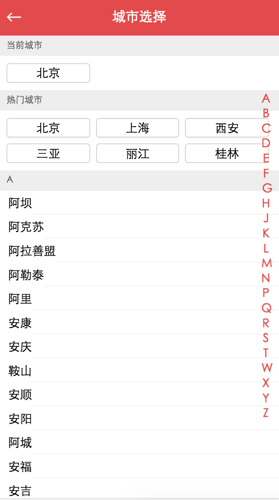

## City 组件开发

- 获取数据

在static\mock目录创建city.json,由于数据太多这里就不粘贴，需要的话从项目源代码里面下载。

在src\api目录创建city.js
```js
import axios from 'axios'

export function getCityList() {
	return axios.get('/api/city.json', {}).then((res) => {
		return Promise.resolve(res.data)
	})
}
```

- 在src目录创建pages\city\City.vue
```html
<template>
  <div>
    <common-header :title="title" :back="true" @goBack="goBack"></common-header>
    <city-list
      :cities="cities"
      :hot="hotCities"
      :letter="letter"
    ></city-list>
    <alphabet
      :cities="cities"></alphabet>
  </div>
</template>

<script>
import CommonHeader from '../../components/header/Header'
import CityList from './components/list/List'
import Alphabet from './components/alphabet/Alphabet'
import { getCityList } from '@/api/city.js'
export default {
  name: 'City',
  components: {
    CommonHeader,
    CityList,
    Alphabet
  },
  data () {
    return {
      title: '城市选择',
      cities: {},
      hotCities: [],
      letter: ''
    }
  },
  methods: {
    goBack() {
      this.$router.back()
    },
    handleLetterChange (letter) {
      this.letter = letter
    }
  },
  mounted () {
    getCityList().then((res) => {
      if (res.code) {
        this.cities = res.cities
        this.hotCities = res.hotCities
      }
    });
  }
}
</script>

<style lang="stylus" scoped>
</style>
```
?> 因为City组件引用了List组件和Alphabet组件，我们分别创建此组件

## 创建List组件
```html
<template>
  <div class="list">
    <scroll class="wrap_content" :data="cities">
      <div>
        <div class="area">
          <div class="title scale-1px">当前城市</div>
          <div class="button-list">
            <div class="button-wrapper">
              <div class="button">北京</div>
            </div>
          </div>
        </div>
        <div class="area">
          <div class="title scale-1px">热门城市</div>
          <div class="button-list">
            <div
              class="button-wrapper"
              v-for="item of hot"
              :key="item.id"
            >
              <div class="button">{{item.name}}</div>
            </div>
          </div>
        </div>
        <div
          class="area"
          v-for="(item, key) of cities"
          :key="key"
          :ref="key"
        >
          <div class="title scale-1px">{{key}}</div>
          <div class="item-list">
            <div
              class="item scale-1px"
              v-for="innerItem of item"
              :key="innerItem.id"
            >
              {{innerItem.name}}
            </div>
          </div>
        </div>
      </div>
    </scroll>
  </div>
</template>

<script>
import Scroll from '@/components/scroll/Scroll'
export default {
  name: 'List',
  props: {
    hot: Array,
    cities: Object,
    letter: String
  },
  components: {
    Scroll
  }
}
</script>

<style lang="stylus" scoped>
  @import '~stylus/variable.styl'
  .list
    width: 100%
    top: 50px
    bottom: 0
    left: 0
    right: 0
    position: fixed
    .wrap_content
      overflow: hidden
      height: 100%      
      .title
        line-height: 27px
        background: #eee
        padding-left: 10px
        color: #666
        font-size: 12px
      .button-list
        overflow: hidden
        padding: 6px 10px 6px 6px;
        .button-wrapper
          float: left
          width: 33.33%
          .button
            margin: 4px
            padding: 4px 0
            text-align: center
            border: 1px solid #ccc
            border-radius: 4px
      .item-list
        .item
          line-height: 32px
          padding-left: 12px
</style>
```

## 创建Alphabet组件
```html
<template>
  <ul class="list">
    <li
      class="item"
      v-for="item of letters"
      :key="item"
      :ref="item"
    >
      {{item}}
    </li>
  </ul>
</template>

<script>
export default {
  name: 'Alphabet',
  props: {
    cities: Object
  },
  computed: {
    letters () {
      const letters = []
      for (let i in this.cities) {
        letters.push(i)
      }
      return letters
    }
  },
  data () {
    return {
    }
  },
  methods: {
  }
}
</script>

<style lang="stylus" scoped>
  @import '~stylus/variable.styl'
  .list
    display: flex
    flex-direction: column
    justify-content: center
    position: absolute
    top: 20px
    right: 12px
    bottom: 0
    width: 12px
    .item
      line-height: 20px
      text-align: center
      color: $bgColor
</style>
```

至此我们的城市页面已经完成，如下图


## 逻辑开发

点击右侧的字符序列，左侧内容跟着切换，主要实现逻辑就是鼠标点下去获取当前的位置的下标，移动开发到结束这段的距离除以每个字符的高度，再加上开始移动的下标位置，就是移动到哪个位置，然后通过scrollToElement移动左侧的位置。

监听字符序列移动时间，纪录当前移动的位置，向父组件出发change事件

```js
  methods: {
    onTouchStart(e) {
      this.touch.initiated = true
      let anchorIndex = e.target.getAttribute('data-index')
      let firstTouch = e.touches[0]
      this.touch.y1 = firstTouch.pageY
      this.currentIndex = anchorIndex;
      this.$emit('change', this.letters[this.currentIndex])
    },
    onTouchMove(e) {
      if (!this.touch.initiated) {
        return
      }
      let firstTouch = e.touches[0];
      this.touch.y2 = firstTouch.pageY;
      let delta = (this.touch.y2 - this.touch.y1) / 20 | 0;
      let index = parseInt(this.currentIndex) + delta;
      this.$emit('change', this.letters[index])
    },
    onTouchEnd(e) {
      this.touch.initiated = false
      this.$emit('end')   
    }
  }
```

父组件接受change组件，记录当前的letter,向List组件传递
```js
change(letter) {
  this.letter = letter
}
```

List组件接动态监听letter,移动对应的位置
```js
watch: {
	letter () {
	  if (this.letter) {
	    this.$refs.scroll.scrollToElement(this.$refs[this.letter][0])
	  }
	}
}
```

## List组件也可以显示当前的letter
```html
<transition name="fade">
  <p class="currentIndex" v-if="letter">{{letter}}</p>
</transition> 
<style lang="stylus" scoped>
  .currentIndex
    display: inline-block;
    background: #000;
    position: absolute;
    top: 50%;
    left: 50%;
    width: 50px;
    height: 46px;
    text-align: center;
    line-height: 46px;
    border-radius: 6px;
    color: #ccc;
    opacity: .6;
    font-size:20px;
    margin-left: -25px;
    margin-top: -25px;
    &.fade-enter, &.normal-leave-to
        opacity: 0
    &.fade-enter-active, &.fade-leave-active
        transition: opacity .5s;
</style>
```

当移动结束后，Aplhabet向List触发end事件
```js
onTouchEnd(e) {
  this.touch.initiated = false
  this.$emit('end')   
}
```


List接收end,移除letter
```js
end() {
  setTimeout(() => {
    this.letter = ''
  }, 800);  
```


