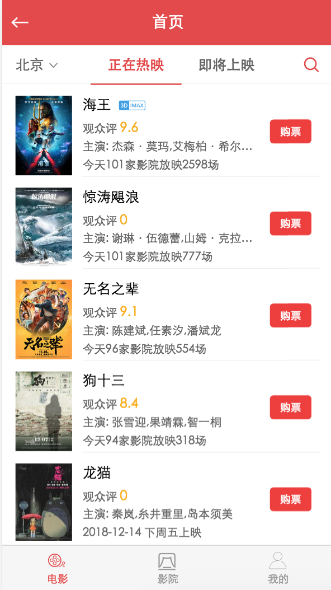

# 首页组件开发

## CommonHeader组件开发

在src目录创建pages\home\Home.vue
```html
<template>
  <div>
    <common-header :title="title" :back="true" @goBack="goBack"></common-header>
  </div>
</template>

<script>
import CommonHeader from '../../components/header/Header'
export default {
  name: 'Home',
  components: {
    CommonHeader
  },
  data () {
    return {
      title: '首页'
    }
  },
  methods: {
    goBack() {
      this.$router.back()
    }
  }
}
</script>
<style>
</style>
```

修改router\index.js
```js
import Vue from 'vue'
import Router from 'vue-router'
import Home from '@/pages/home/Home'
import Start from '@/pages/start/Start'

Vue.use(Router)
export default new Router({
  routes: [
    {
      path: '/',
      name: 'start',
      component: Start
    },
    {
      path: '/home',
      name: 'home',
      component: Home
    }
  ]
})
```
这里我们引入了CommonHeader组件，所以我们在src\components\header下创建Header.vue,
因为CommonHeader属于其他页面公共的组件，所以我们把公共组件都放到components目录下，方便引用

```html
<template>
  <div class="header">
    <div class="header-left" v-if="back" @click="goBack">
      <span class="iconfont icon-zuojiantou"></span>
    </div>
    <h1 class="title" v-text="title"></h1>
  </div>
</template>

<script>
export default {
  name: 'Header',
  props: {
    title: {
      type: String,
      default: ''
    },
    back: {
      type: Boolean,
      default: false
    }
  },
  methods: {
    goBack() {
      this.$emit('goBack')
    }
  }
}
</script>

<style lang="stylus" scoped>
  @import '~stylus/variable.styl'
  .header
    height: 50px
    color: #fff
    background: $bgColor
    border-bottom: 1px solid #e54847
    position: relative
    .header-left
      position: absolute
      left: 10px
      top: 16px
      .icon-zuojiantou
        font-size:20px
    .title
      font-size: 18px
      font-weight: 400
      text-align: center
      line-height: 50px
      color: #fff
</style>
```
?> CommonHeader 只做页面显示，不处理逻辑，如果其他组件需要引用它时候需要传参数，和监听对应的goBack函数。

## NavMenu 组件开发
因为NavMenu只是home页的组件，所以在home组件页下创建components\nav-menu\NavMenu组件
```html
<template>
  <div class="nav-menu scale-1px">
    <router-link to='/city'>
      <div class="left">
          <span>北京</span>
          <span class="iconfont icon-xiala"></span>
      </div>
    </router-link>
    <div class="center">
      <span class="menu" :class="[menuActive == menu.id ? 'active' : '']" @click="changeMenu(menu.id)" v-for="menu of menuList" :key="menu.id">
        {{ menu.title }}
      </span>
    </div>
    <router-link to='/search'>
      <div class="right">
        <span class="iconfont icon-sousuo"></span>  
      </div>
    </router-link>
  </div>
</template>

<script>
export default {
  name: 'NavMenu',
  props: {
    menuActive: {
      type: Number,
      default: 0
    }
  },
  data() {
    return {
      menuList: [
        {
          id: 0,
          title: '正在热映'
        },
        {
          id: 1,
          title: '即将上映'
        }
      ]
    }
  },
  methods: {
    changeMenu(menuId) {
      this.$emit('changeMenu', menuId);
    }
  }
}
</script>

<style lang="stylus" scoped>
  @import '~stylus/variable.styl'
  .nav-menu
    height: 44px
    display: flex
    .left
      width: 80px
      float: left
      line-height:44px
      color: #666
      text-align: center
      .icon-xiala
        font-size:14px
    .center
      flex: 1
      text-align: center
      line-height:44px
      padding: 0 20px
      position: relative
      .menu
        display:inline-block
        color: #666
        font-weight: 700
        width: 50%;
        float: left;
        box-sizing: border-box;
        &.active
          color: $bgColor
          &:after
            content: ""
            display: block
            position: absolute
            bottom: -1px
            width: calc(50% - 20px);
            height: 2px
            background-color: $bgColor
    .right
      float: right
      width: 50px
      color: $bgColor
      line-height:44px
      text-align: center
      font-size:16px
      font-weight: bold
</style>
```
?> 这个组件需要注意的是使用了选中的menu下划线使用了calc的函数，具体calc使用可以去网上搜索

然后再Home.vue里引用该组件
```js
1. import NavMenu from './components/nav-menu/NavMenu'
2. components: {
    CommonHeader,
    NavMenu
  },
3. <nav-menu :menu-active="menuActive" @changeMenu="changeMenu"></nav-menu>
```

## 内容组件开发

- 先获取数据接口
再static\创建mock\home.json
```json
{
    "code": 1,
  "movieList": [
    {
      "id": 249342,
      "haspromotionTag": false,
      "img": "https://p0.meituan.net/128.180/movie/c106904da68edd848afd4a320976d051346321.jpg",
      "version": "v3d imax",
      "nm": "海王",
      "preShow": false,
      "sc": 9.6,
      "globalReleased": true,
      "wish": 250996,
      "star": "杰森·莫玛,艾梅柏·希尔德,妮可·基德曼",
      "rt": "2018-12-07",
      "showInfo": "今天101家影院放映2598场",
      "showst": 3,
      "wishst": 0
    },
    {
      "id": 1220969,
      "haspromotionTag": false,
      "img": "https://p0.meituan.net/128.180/movie/3020fcde26f323551243819629c251a8376809.jpg",
      "version": "",
      "nm": "惊涛飓浪",
      "preShow": false,
      "sc": 0,
      "globalReleased": true,
      "wish": 36139,
      "star": "谢琳·伍德蕾,山姆·克拉弗林,伊丽莎白·霍桑",
      "rt": "2018-12-07",
      "showInfo": "今天101家影院放映777场",
      "showst": 3,
      "wishst": 0
    },
    {
      "id": 1208282,
      "haspromotionTag": false,
      "img": "https://p0.meituan.net/128.180/movie/3e7696319c840d4890e947b926259d532809641.jpg",
      "version": "",
      "nm": "无名之辈",
      "preShow": false,
      "sc": 9.1,
      "globalReleased": true,
      "wish": 15666,
      "star": "陈建斌,任素汐,潘斌龙",
      "rt": "2018-11-16",
      "showInfo": "今天96家影院放映554场",
      "showst": 3,
      "wishst": 0
    },
    {
      "id": 78480,
      "haspromotionTag": false,
      "img": "https://p0.meituan.net/128.180/movie/feb4cd6eb054232b4851a97bbc2a66d51198036.jpg",
      "version": "",
      "nm": "狗十三",
      "preShow": false,
      "sc": 8.4,
      "globalReleased": true,
      "wish": 18506,
      "star": "张雪迎,果靖霖,智一桐",
      "rt": "2018-12-07",
      "showInfo": "今天94家影院放映318场",
      "showst": 3,
      "wishst": 0
    },
    {
      "id": 123,
      "haspromotionTag": false,
      "img": "https://p0.meituan.net/128.180/movie/c304c687e287c7c2f9e22cf78257872d277201.jpg",
      "version": "",
      "nm": "龙猫",
      "preShow": false,
      "sc": 0,
      "globalReleased": false,
      "wish": 105627,
      "star": "秦岚,糸井重里,岛本须美",
      "rt": "2018-12-14",
      "showInfo": "2018-12-14 下周五上映",
      "showst": 4,
      "wishst": 0
    },
    {
      "id": 1215919,
      "haspromotionTag": false,
      "img": "https://p0.meituan.net/128.180/movie/2205b5298f91edc2b072f1dbc8d4e46e5518392.jpg",
      "version": "",
      "nm": "印度合伙人",
      "preShow": false,
      "sc": 0,
      "globalReleased": false,
      "wish": 18745,
      "star": "阿克谢·库玛尔,索娜姆·卡普尔,雷.雷富",
      "rt": "2018-12-14",
      "showInfo": "2018-12-14 下周五上映",
      "showst": 4,
      "wishst": 0
    },
    {
      "id": 42964,
      "haspromotionTag": false,
      "img": "https://p0.meituan.net/128.180/movie/363e3a7e614d29b2847ff4e62afcd3f42168651.jpg",
      "version": "v3d imax",
      "nm": "毒液：致命守护者",
      "preShow": false,
      "sc": 9.3,
      "globalReleased": true,
      "wish": 393571,
      "star": "汤姆·哈迪,米歇尔·威廉姆斯,里兹·阿迈德",
      "rt": "2018-11-09",
      "showInfo": "今天52家影院放映151场",
      "showst": 3,
      "wishst": 0
    },
    {
      "id": 341213,
      "haspromotionTag": false,
      "img": "https://p0.meituan.net/128.180/movie/600beaeaa9929649f38181d41f2c8578328129.jpg",
      "version": "v3d imax",
      "nm": "无敌破坏王2：大闹互联网",
      "preShow": false,
      "sc": 8.9,
      "globalReleased": true,
      "wish": 102436,
      "star": "约翰·C·赖利,萨拉·西尔弗曼,克里斯汀·贝尔",
      "rt": "2018-11-23",
      "showInfo": "今天50家影院放映111场",
      "showst": 3,
      "wishst": 0
    },
    {
      "id": 344649,
      "haspromotionTag": false,
      "img": "https://p1.meituan.net/128.180/movie/19efcfbf1a98c02cb5efd69a2edf766e2421917.jpg",
      "version": "v2d imax",
      "nm": "天气预爆",
      "preShow": false,
      "sc": 0,
      "globalReleased": false,
      "wish": 23097,
      "star": "肖央,杜鹃,常远",
      "rt": "2018-12-21",
      "showInfo": "2018-12-21上映",
      "showst": 4,
      "wishst": 0
    },
    {
      "id": 1207271,
      "haspromotionTag": false,
      "img": "https://p0.meituan.net/128.180/movie/677dce9488e154c11afa8fb2fef0725a831453.png",
      "version": "",
      "nm": "憨豆特工3",
      "preShow": false,
      "sc": 8.6,
      "globalReleased": true,
      "wish": 94378,
      "star": "罗温·艾金森,本·米勒,欧嘉·柯瑞兰寇",
      "rt": "2018-11-23",
      "showInfo": "今天28家影院放映62场",
      "showst": 3,
      "wishst": 0
    },
    {
      "id": 346465,
      "haspromotionTag": false,
      "img": "https://p0.meituan.net/128.180/movie/3e073bbe2abbdad57f6768270acbb6d85873182.jpg",
      "version": "v3d imax",
      "nm": "绿毛怪格林奇",
      "preShow": false,
      "sc": 0,
      "globalReleased": false,
      "wish": 8396,
      "star": "本尼迪克特·康伯巴奇,卡梅伦·丝蕾,拉什达·琼斯",
      "rt": "2018-12-14",
      "showInfo": "2018-12-14 下周五上映",
      "showst": 4,
      "wishst": 0
    },
    {
      "id": 341753,
      "haspromotionTag": false,
      "img": "https://p0.meituan.net/128.180/movie/30aff57a6e035d8a147806b4e207b1c67586143.jpg",
      "version": "",
      "nm": "三只小猪2",
      "preShow": false,
      "sc": 8.3,
      "globalReleased": false,
      "wish": 16481,
      "star": "王晓彤,李晔,洪海天",
      "rt": "2018-12-08",
      "showInfo": "2018-12-08 本周六重映",
      "showst": 4,
      "wishst": 0
    }
  ],
  "comingList": [
    {
      "id": 341753,
      "haspromotionTag": false,
      "img": "https://p0.meituan.net/128.180/movie/30aff57a6e035d8a147806b4e207b1c67586143.jpg",
      "version": "",
      "nm": "三只小猪2",
      "preShow": false,
      "sc": 8.3,
      "globalReleased": false,
      "wish": 16481,
      "star": "王晓彤,李晔,洪海天",
      "rt": "2018-12-08",
      "showInfo": "2018-12-08 本周六重映",
      "showst": 4,
      "wishst": 0,
      "comingTitle": "12月8日 周六"
    },
    {
      "id": 1227795,
      "haspromotionTag": false,
      "img": "https://p0.meituan.net/128.180/movie/a8cc227734ef0449f457341cfb93aabe187083.jpg",
      "version": "",
      "nm": "云上日出",
      "preShow": false,
      "sc": 0,
      "globalReleased": false,
      "wish": 692,
      "star": "荣梓杉,关亚,丁宁",
      "rt": "2018-12-11",
      "showst": 1,
      "wishst": 0,
      "comingTitle": "12月11日 周二"
    },
    {
      "id": 1238951,
      "haspromotionTag": false,
      "img": "https://p1.meituan.net/128.180/movie/cf6230938a60b584e1fe1618ca9b3a2a8575606.jpg",
      "version": "",
      "nm": "谁是坏孩子",
      "preShow": false,
      "sc": 0,
      "globalReleased": false,
      "wish": 313,
      "star": "安智辉,方从伊,沙学周",
      "rt": "2018-12-11",
      "showst": 1,
      "wishst": 0,
      "comingTitle": "12月11日 周二"
    },
    {
      "id": 1228750,
      "haspromotionTag": false,
      "img": "https://p1.meituan.net/128.180/movie/03b64c266a863c74d547feaef1859eab3294680.jpg",
      "version": "",
      "nm": "照相师",
      "preShow": false,
      "sc": 0,
      "globalReleased": false,
      "wish": 855,
      "star": "谢钢,刘牧,康磊",
      "rt": "2018-12-12",
      "showst": 1,
      "wishst": 0,
      "comingTitle": "12月12日 周三"
    },
    {
      "id": 1238952,
      "haspromotionTag": false,
      "img": "https://p1.meituan.net/128.180/movie/a0f9704bb208c24359df82e88a16315c91983.jpg",
      "version": "",
      "nm": "缘·梦",
      "preShow": false,
      "sc": 0,
      "globalReleased": false,
      "wish": 144,
      "star": "高蕊,刘滨,张津赫",
      "rt": "2018-12-13",
      "showst": 1,
      "wishst": 0,
      "comingTitle": "12月13日 周四"
    },
    {
      "id": 123,
      "haspromotionTag": false,
      "img": "https://p0.meituan.net/128.180/movie/c304c687e287c7c2f9e22cf78257872d277201.jpg",
      "version": "",
      "nm": "龙猫",
      "preShow": false,
      "sc": 0,
      "globalReleased": false,
      "wish": 106812,
      "star": "秦岚,糸井重里,岛本须美",
      "rt": "2018-12-14",
      "showInfo": "2018-12-14 下周五上映",
      "showst": 4,
      "wishst": 0,
      "comingTitle": "12月14日 周五"
    },
    {
      "id": 1215919,
      "haspromotionTag": false,
      "img": "https://p0.meituan.net/128.180/movie/2205b5298f91edc2b072f1dbc8d4e46e5518392.jpg",
      "version": "",
      "nm": "印度合伙人",
      "preShow": false,
      "sc": 0,
      "globalReleased": false,
      "wish": 18902,
      "star": "阿克谢·库玛尔,索娜姆·卡普尔,雷.雷富",
      "rt": "2018-12-14",
      "showInfo": "2018-12-14 下周五上映",
      "showst": 4,
      "wishst": 0,
      "comingTitle": "12月14日 周五"
    },
    {
      "id": 346465,
      "haspromotionTag": false,
      "img": "https://p0.meituan.net/128.180/movie/3e073bbe2abbdad57f6768270acbb6d85873182.jpg",
      "version": "v3d imax",
      "nm": "绿毛怪格林奇",
      "preShow": false,
      "sc": 0,
      "globalReleased": false,
      "wish": 8530,
      "star": "本尼迪克特·康伯巴奇,卡梅伦·丝蕾,拉什达·琼斯",
      "rt": "2018-12-14",
      "showInfo": "2018-12-14 下周五上映",
      "showst": 4,
      "wishst": 0,
      "comingTitle": "12月14日 周五"
    },
    {
      "id": 1219776,
      "haspromotionTag": false,
      "img": "https://p0.meituan.net/128.180/movie/da4eb7b46debc0ee54ec7b5ff371198c944440.jpg",
      "version": "",
      "nm": "网络谜踪",
      "preShow": true,
      "sc": 0,
      "globalReleased": false,
      "wish": 5858,
      "star": "约翰·赵,黛博拉·梅辛,米切尔·拉",
      "rt": "2018-12-14",
      "showInfo": "2018-12-14 下周五上映",
      "showst": 4,
      "wishst": 0,
      "comingTitle": "12月14日 周五"
    },
    {
      "id": 1229950,
      "haspromotionTag": false,
      "img": "https://p0.meituan.net/128.180/movie/5581cf675d3d623685328facc05abd933568286.jpg",
      "version": "",
      "nm": "午夜整容室",
      "preShow": false,
      "sc": 0,
      "globalReleased": false,
      "wish": 4402,
      "star": "赖晶晶,王李丹妮,陈垚",
      "rt": "2018-12-14",
      "showInfo": "2018-12-14 下周五上映",
      "showst": 4,
      "wishst": 0,
      "comingTitle": "12月14日 周五"
    }
  ]
}
```
修改config\index.js
```js
proxyTable: {
  '/api': {
    target: 'http://localhost:8081',
    pathRewrite: {
        '^/api' : '/static/mock'
    }
  }
} 
```
?> 这里使用的是代理请求，访问api目录的时候能代理到/static/mock，端口号改成自己的端口，重新启动webpack则可以在浏览器访问http://localhost:8081/api/home.json

- 获取异步数据
```bash
npm install -D axios
npm run dev
```

在src目录创建api\home.js
```js
import axios from 'axios'

export function getMoiveList() {
  return axios.get('/api/home.json', {}).then((res) => {
    return Promise.resolve(res.data)
  })
}
```

- 因为我们这里是使用滚动条，所以要引入better-scroll组件

npm install -D better-scroll

在src\components\srcoll编写scroll组件
```html
<template>
  <div ref="wrapper">
    <slot></slot>
  </div>
</template>

<script type="text/ecmascript-6">
  import BScroll from 'better-scroll'

  export default {
    props: {
      probeType: {
        type: Number,
        default: 1
      },
      click: {
        type: Boolean,
        default: true
      },
      data: {
        type: Array|Object,
        default: null
      },
      refreshDelay: {
        type: Number,
        default: 20
      }
    },
    mounted() {
      setTimeout(() => {
        this._initScroll()
      }, 20)
    },
    methods: {
      _initScroll() {
        if (!this.$refs.wrapper) {
          return
        }
        this.scroll = new BScroll(this.$refs.wrapper, {
          probeType: this.probeType,
          click: this.click
        })
      },
      refresh() {
        this.scroll && this.scroll.refresh()
      }
    },
    watch: {
      data() {
        setTimeout(() => {
          this.refresh()
        }, this.refreshDelay)
      }
    }
  }
</script>

<style scoped lang="stylus">
</style>
```

- 在pages\home\component\content\创建Content组件
```html
<template>
  <div class="content" v-if="menuActive == 0">
    <scroll :data="movieList" class="wrap_content">
      <div>
        <div class="movie" v-for="movie of movieList" :key="movie.id">
          <div class="avatar">
            
          </div>
          <div class="wrap scale-1px">
            <div class="desc">
                <div class="title">
                  <span>{{ movie.nm }}</span>
                  <span class="iconfont icon-shijue3dimax" v-if="movie.version">
              </span>
                </div>
                <div class="score">
                  <span class="suffix">观众评</span>
                  <span class="grade">{{ movie.sc }}</span>
                </div>
                <p class="actor">主演: {{ movie.star }}</p>
                <p class="show-info">{{ movie.showInfo }}</p>
            </div>
            <div class="btn">
              <a href="javascript" class="go">购票</a>
            </div>
          </div>   
        </div>
      </div>
    </scroll>
  </div>

  <div class="content" v-else-if="menuActive == 1">
    <scroll :data="comingList" class="wrap_content">
      <div>
        <div v-for="(group,index) of comingList" :key="index">
          <div class="date">
              <p>{{ group.date }} {{ weeked(group.date) }}</p>
          </div>
          <div class="movie" v-for="coming of group.items" :key="coming.id">
            <div class="avatar">
              
              <span class="iconfont icon-shijue3dimax" v-if="coming.version">
              </span>
            </div>
            <div class="wrap scale-1px">
              <div class="desc">
                  <div class="title">
                    <span>{{ coming.nm }}</span>
                  </div>
                  <div class="score">
                    <span class="suffix">观众评</span>
                    <span class="grade">{{ coming.sc }}</span>
                  </div>
                  <p class="actor">主演: {{ coming.star }}</p>
                  <p class="show-info">{{ coming.showInfo }}</p>
              </div>
              <div class="btn">
                <a href="javascript" class="ys">预售</a>
              </div>
            </div>   
          </div>
        </div>
      </div>
    </scroll>
  </div>

</template>

<script>
import { getMoiveList } from '@/api/home.js'
import Scroll from '@/components/scroll/Scroll'
export default {
  name: 'Content',
  props: {
    menuActive: {
      type: Number,
      default: 0
    }
  },
  data() {
    return {
      movieList: [],
      comingList: []
    }
  },
  mounted() {
    getMoiveList().then((res) => {
      if (res.code) {
        this.movieList = res.movieList
        this.comingList = this.parseComingList(res.comingList)
      }
    })
  },
  components: {
    Scroll
  },
  methods: {
    weeked(date) {
      let weekDay = ['周日', '周一', '周二', '周三', '周四', '周五', '周六'];
      let myDate = new Date(Date.parse(date));  
      return weekDay[myDate.getDay()];
    },
    parseComingList(comingList) {
      let map = {};
      comingList.forEach((item, index) => {
        let rt = item.rt
        if (!map[rt]) {
          map[rt] = {
            items: [],
            date: rt
          }
        }        
        map[rt].items.push(item)
      });
      let arr = [];
      for (let key in map) {
        arr.push(map[key]);
      }
      return arr;
    }
  }
}
</script>

<style lang="stylus" scoped>
  @import '~stylus/mixins.styl'
  .content
    position: fixed
    width: 100%
    top: 96px
    bottom: 56px
    .wrap_content
      overflow: hidden
      height: 100%
      .date
        padding: 12px 15px 0;
        margin: 0;
        font-size: 14px;
        color: #333;
      .movie
        display: flex
        padding-left: 15px;
        padding-right: 15px;
        background-color: #fff;
        .avatar
          flex: 0 0 64px;
          height: 90px;
          margin-top: 12px;
          img
            width: 64px;
            height: 90px;
        .wrap
          flex: 1;
          margin-left: 12px
          position: relative;
          .desc
            width: 200px
            padding-top: 10px;
            padding-bottom: 6px;
            .title
              height: 24px;
              margin-bottom: 7px;
              line-height: 24px;
              overflow: hidden;
              .icon-shijue3dimax
                font-size:40px
                vertical-align: middle
                color: #3c9fe6;
            .score
              font-size: 13px;
              color: #666;
              .grade
                font-weight: 700;
                color: #faaf00;
                font-size: 15px;
            .actor
              font-size: 13px;
              color: #666;
              margin-top: 6px;
              line-height: 15px;
              no-wrap()
            .show-info
              margin-top: 6px;
              line-height: 15px;
              font-size: 13px;
              color: #666;
          .btn
            font-size: 12px;
            position: absolute;
            right: 10px;
            top: 0;
            bottom: 0;
            height: 27px;
            margin: auto;
            .go
              display:inline-block;
              width: 47px;
              height: 27px;
              line-height: 28px;
              text-align: center;
              box-sizing: border-box;
              background-color: #f03d37;
              color: #fff;
              border-radius: 4px;
              white-space: nowrap;
              font-size: 12px;
              cursor: pointer;
              text-decoration: none;
            .ys
              display:inline-block;
              width: 47px;
              height: 27px;
              line-height: 28px;
              text-align: center;
              box-sizing: border-box;
              background-color: #3c9fe6;
              color: #fff;
              border-radius: 4px;
              white-space: nowrap;
              font-size: 12px;
              cursor: pointer;
              text-decoration: none;  

</style>
```
?> 这个组件没有什么逻辑性内容，只需要home组件传递menuActive 显示对应的内容即可。

- 在home组件引入content组件
```js
import MovieContent from './components/content/Content'
components: {
  CommonHeader,
  NavMenu,
  MovieContent,
},
```
还需要向Content组件传递menuActive,默认让第几个内如区域显示。


## CommonFooter组件开发

在src目录创建pages\footer\Footer.vue

```html
<template>
  <div class="bottom">
    <div class="btn-item" v-for="(item,index) of itemList" :key="index">
      <router-link :to="item.href" :class="[bottomActive == index ? 'active' : '']">
        <span class="iconfont" :class="item.icon"></span>
        <p>{{ item.title }}</p>
      </router-link>
    </div>
  </div>
</template>
<script>
export default {
  name: 'Footer',
  props: {
    bottomActive: {
      type: Number,
      default: 0
    }   
  },
  data() {
    return {
      itemList: [
        {
          id: 0,
          title: '电影',
          icon: 'icon-dianying',
          href: '/home'
        },
        {
          id: 1,
          title: '影院',
          icon: 'icon-yingyuan',
          href: '/cinema'
        },
        {
          id: 2,
          title: '我的',
          icon: 'icon-home',
          href: '/my'
        }
      ]
    }
  }
}
</script>

<style lang="stylus" scoped>
  @import '~stylus/variable.styl'
  .bottom
    position: fixed;
    bottom:0;
    width: 100%;
    height: 50px;
    display: flex;
    border-top: 1px solid #d6d6d6;
    background-color: rgba(246,246,246,0.95);
    .btn-item
      text-decoration: none;
      flex: 1;
      font-size:11px;
      display: flex;
      flex-direction: column;
      align-items: center;
      justify-content: center;
      a
        text-decoration: none;
        color: #999;
        &.active
          color: $bgColor;
      .iconfont
        font-size: 22px;
      p
        margin-top: 4px;
</style>
``` 

- 在home组件引入CommonFooter组件
```js
import CommonFooter from '../../components/footer/Footer'
components: {
  CommonHeader,
  NavMenu,
  MovieContent,
  CommonFooter
},
```
还需要像Footer组件传递bottomActive,默认让第几个菜单激活。

?> 至此，home组件已经完成，效果如下:



