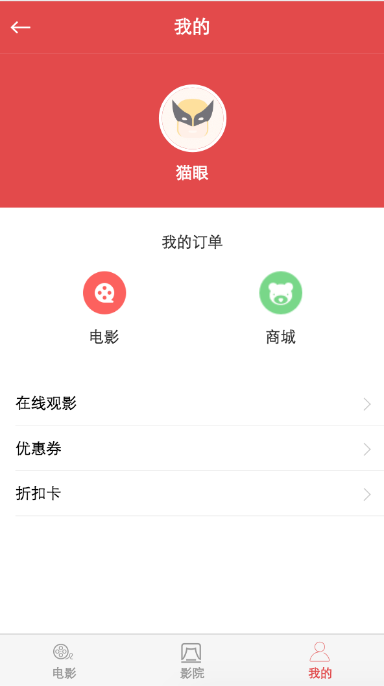

## 个人中心组件开发

该组件比较简单

```html
<template>
  <div>
  	<common-header :title="title" :back="true" @goBack="goBack"></common-header>
    <div class="my-center">
      <div class="header">
        
        <p class="name">猫眼</p>
      </div>
      <div class="container">
        <div class="group">
          <div class="orders">
            <div class="title">我的订单</div>
            <div class="list">
                <div class="order-item movie">
                    <p>电影</p>
                </div>
                <div class="order-item store">
                  <p>商城</p>
                </div>
            </div>
          </div>
        </div>
        <div class="group">
          <div class="item scale-1px"><div>在线观影</div></div>
          <div class="item scale-1px"><div>优惠券</div></div>
          <div class="item scale-1px"><div>折扣卡</div></div>
        </div>
      </div>
    </div>
    <common-footer :bottom-active="bottomActive"></common-footer>
  </div>
</template>

<script>
import CommonHeader from '../../components/header/Header'
import CommonFooter from '../../components/footer/Footer'
export default {
  name: 'My',
  components: {
    CommonHeader,
    CommonFooter
  },
  data () {
    return {
      title: '我的',
      bottomActive: 2
    }
  },
  methods: {
    goBack() {
      this.$router.back()
    }
  }
}
</script>
<style lang="stylus" scoped>
  @import '~stylus/variable.styl'
  .my-center
    min-height: 100%;
    display: flex;
    flex-direction: column;
    .header
      background-color: $bgColor;
      height: 150px;
      overflow: hidden;
      text-align: center;
      img
        display: inline-block;
        margin-top: 30px;
        width: 60px;
        height: 60px;
        border-radius: 60px;
        border: 3px solid #fff;
      .name
        margin-top: 7px;
        font-size: 16px;
        line-height: 22.5px;
        color: #fff;
    .container
      flex: 1;
      .group
        margin-top: 10px;
        background: #fff;
      .orders
        padding: 0 15px;
        position: relative;
        overflow: hidden;
        text-align: center;
        .title
          position: relative;
          margin: 13px 0 0;
          font-size: 15px;
          line-height: 21px;
          height: 21px;
          color: #333;
          z-index: 9;
          display: inline-block;
          width: 80px;
          background-color: #fff;
        .list
          overflow: hidden;          
        .order-item
          float: left;
          height: 97px;
          background-repeat: no-repeat;
          background-position: top;
          background-size: 42px auto;
          margin-top: 18px;
          width: 50%;
          p
            position: relative;
            top: 53px;
            text-align: center;
            font-size: 15px;
            line-height: 21px;
            height: 21px;
            margin: 0;
            color: #333;
          &.movie
            background-image: url(./images/movie.png);
          &.store
            background-image: url(./images/store.png);
      .item
        position: relative;
        height: 44px;
        line-height: 44px;
        font-size: 15px;
        margin-left: 15px;
        padding-right: 15px;
        &::before
          position: absolute;
          right: 15px;
          top: 18px;
          display: inline-block;
          content: "";
          width: 8px;
          height: 8px;
          border-left: 1px solid #ccc;
          border-top: 1px solid #ccc;
          transform: rotate(135deg);
</style>
```

在router\index.js 引入My组件
```js
import My from '@/pages/my/My'
{
  path: '/my',
  name: 'my',
  component: My
}
```

?> 至此，my组件已经完成，效果如下:

