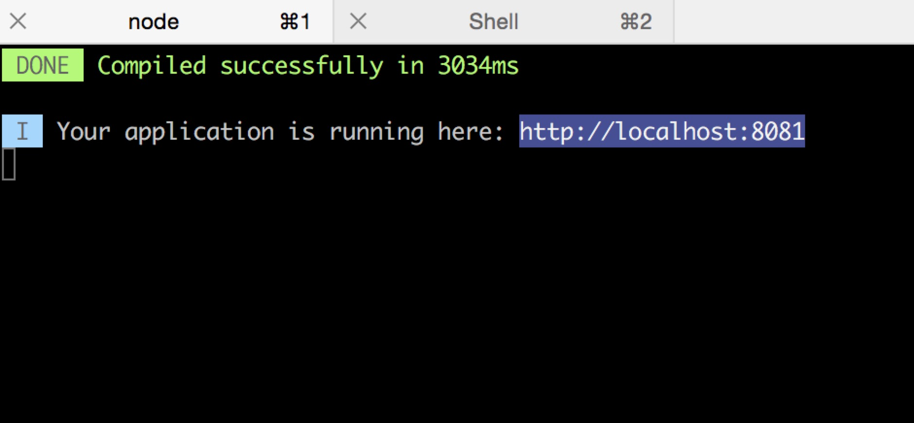
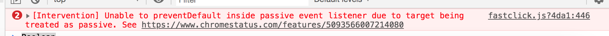

## Eslint
> ESLint 是一个代码规范和错误检查工具，可以用来保证写出语法正确、风格统一的代码。

比如说可以帮助我们避免一些非常低级的错误，一些格式上的问题导致我们在运行生产环境的时候出现一些不明所以的报错。还有就是在跟团队协作的时候，每个人都保持同一个风格进行代码书写，这样团队内部相互去看别人的代码的时候，就可以更容易的看懂。所以还是搭建构建项目选择使用Eslint。


## Vue-cli
Vue CLI 是一个基于 Vue.js 进行快速开发的完整系统。使用它可以基于 webpack 构建，把我们把基础工程都配置好，我们只用关于开发的部分。
```bash
npm install -g vue-cli -g代表全局安装
```

## npm淘宝镜像
npm国外的镜像安装速度比较慢，所以建议切换成国内淘宝的镜像
```bash
npm config set registry https://registry.npm.taobao.org
```
	
## 项目搭建
```bash
vue init webpack maoyan  webpack基于webpack搭建项目 maoyan是指我们的项目

```
?>eslint,vue-router都选择yes进行安装,unit tests,e2e test ,我们这里不使用所以选择no不安装,其他选项默认回车。

```bash
cd maoyan
npm run dev

```


在浏览器访问上面图片提示开发的地址，就可以打开我们的项目。

## 项目目录介绍

- bulid webpack编辑打包配置目录
- config 项目配置
- node_modules npm包
- src 开发需要的目录
	- assets 资源目录
	- components 组件目录
	- router 路由目录
	- App.vue App组件
	- main.js 项目入口
- static 静态资源目录
- .babelrc babel 配置文件
- .eslint  eslint 配置文件
- .postcssrc webpack处理css插件配置
- .package npm配置信息


## eslint设置
eslint 可以根据自己实际开发习惯关闭一些常用的规则约束，更多的规则可以去查询[eslint rule约束](https://blog.csdn.net/xuyanquan/article/details/79037840)。

我这里进行以下的设置，打开.eslintrc.js文件，在rules对象下添加以下约束。

```js
    'eol-last': 'off',
    'indent': 'off',
    'no-tabs': 'off',
    'no-mixed-spaces-and-tabs': 'off',
    'space-before-function-paren': 'off',
    'no-trailing-spaces': 'off',
    "semi": 'off', // 允许分号
    'space-infix-ops': 0 // [i+1]
```
?> 这里大家需要注意，可能开发eslint会提示各种错误，比如参数后面，变量赋值，if语句等等都要加空格等等,遇到不懂的搜索一下eslint提示的是什么意思，希望大家还是要按照规范坚持下去。

## viewport设置
更改适口大小
```html
<meta name="viewport" content="width=device-width,initial-scale=1.0,minimum-scale=1.0,maximum-scale=1.0,user-scalable=no">	
```


## iconfont字体库
打开 [iconfont](http://www.iconfont.cn)。
将想要的图标字体加入购物车，然后点击右上角购物车按钮，下载至本地。

在src\assets\创建以下两个文件夹
- iconfont
- stylus

将下载好的字体库移动到iconfot文件夹（4个），将inconfont.css 移动到stylus文件夹，重命名iconfont.styl，并修改成stylus风格(只要就是把'{','}'去掉)

安装对应的stylus loader
```bash
npm install stylus stylus-loader -D
```

## reset.styl
打开 [reset.css](https://meyerweb.com/eric/tools/css/reset/)。
在src\assets\stylus下新建reset.styl 将上面网站中的css内容粘贴进去，并改成stylus风格(只要就是把'{','}'去掉)

## 1px边框问题
页面不管几倍屏幕，看起来1px边框都是1px,解决方案就是判断当前窗口在几drp像素下,进行Y轴缩放比例，我们在reset.styl 定义全局的解决1px边框的样式。
```css
.scale-1px
	position: relative
	&:after
		content: ''
		position: absolute
		bottom: 0
		background: #e6e6e6
		width: 100%
		height: 1px
		transform-origin: 0 0
		transform: scaleY(0.5)
		@media (-webkit-min-device-pixel-ratio: 3),(min-device-pixel-ratio: 3)
			transform: scaleY(0.33)
```


## mixin.styl
我们平时很多代码都需要用处理一些重复的css功能，如文字不换行，2x,3x背景图片等，都可以利用stylus提供的mixin封装成一个函数再需要的页面去调用

在src\assets\stylus下新建mixin.styl粘贴
```css
no-wrap()
  text-overflow: ellipsis
  overflow: hidden
  white-space: nowrap

bg-image($url)
  background-image: url("./images/"+ $url + "@2x.png")
  @media (-webkit-min-device-pixel-ratio: 3),(min-device-pixel-ratio: 3)
    background-image: url("./images/"+ $url + "@3x.png")
```

## variable.styl
该文件可以定义一些css变量，如网站主色调，字体大小等。

在src\assets\stylus下新建variable.styl粘贴,这个颜色是我们开发猫眼的主色调
```css
$bgColor = #e54847
```

## styls整合
在src\assets\stylus下新建index.styl
```css
@import "./reset.styl"
@import "./iconfont.styl"
```

## 全局引入styls
打开main.js，引入index.styl
```js
import 'assets/stylus/index.styl'
```
?> 需要修改bulid\webpack.base.conf.js 在alias下添加,相当于设置别名,这样assets就能全局使用
```webpack
'assets': resolve('src/assets')
```

## 移动端点击延迟解决方案
```bash
npm install -S fastclick
```
打开main.js，引入fastclick
```js
import fastclick from 'fastclick'
fastclick.attach(document.body)
```

?> 引入之后，在页面连续点击有可能控制台还是会报错



?> 这时候需要在reset.styl里加入

```css
html
	touch-action: none
```
[具体原因这里可以查看这篇文章](https://www.zhangxinxu.com/wordpress/2018/07/chrome-safari-touchmove-preventdefault-treated-as-passive/)


## 图片懒加载配置
```bash
npm install -S vue-lazyload
```
在src\assets\images目录，将loading.gif移动到该目录

打开main.js，引入vue-lazyload
```js
import VueLazyload from 'vue-lazyload'
Vue.use(VueLazyload, {
  loading: 'assets/images/loading.gif'
})
```

?> 至此，我们搭建了项目的环境和项目开发时的准备。下一节我们就来开发猫眼启动页吧。


