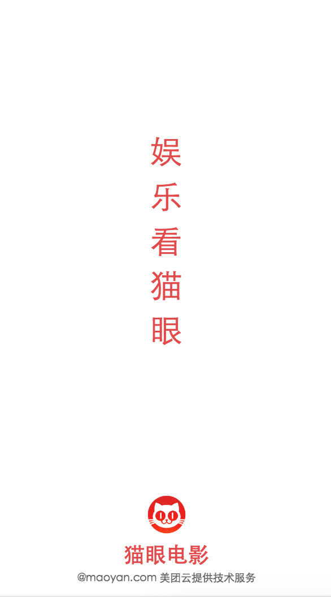

## 启动页组件开发

在src目录创建pages\start\Start.vue
```html
<template>
  <div class="start_wrap">
    <div class="text">
      娱乐看猫眼
    </div>
    <div class="bottom">
      <div class="icon"></div>
      <p class="title">{{ title }}</p>
      <p class="copyright">@maoyan.com 美团云提供技术服务</p>
    </div>
  </div>
</template>

<script>
export default {
  name: 'Start',
  data () {
    return {
      title: '猫眼电影'
    }
  },
  mounted() {
    setTimeout(() => {
      this.$router.push('/home')
    }, 2500)
  }
}
</script>
<style lang="stylus" scoped>
  @import '~stylus/variable.styl'
  @import '~stylus/mixins.styl'
  .start_wrap
    color: $bgColor
    position: absolute;
    top: 0;
    right: 0;
    bottom: 0;
    left: 0;
    display:flex
    align-items: center
    flex-direction: column
    justify-content: center
    margin-top: -128px
    .text
      width:70px;
      font-size:36px
      line-height:50px
    .bottom
      position: absolute
      bottom: 10px
      line-height:20px
      .icon
        bg-image('logo')
        width: 50px
        height: 50px
        background-size: 50px 50px
        margin:10px auto
      .title
        font-weight:bold
        font-size:24px
        margin-bottom:6px
        text-align: center
      .copyright
        color:#666
        font-size:12px
</style>
```

修改router\index.js
```js
import Vue from 'vue'
import Router from 'vue-router'
import Start from '@/pages/start/Start'

Vue.use(Router)
export default new Router({
  routes: [
    {
      path: '/',
      name: 'start',
      component: Start
    }
  ]
})
```



## 注意事项
这个组件还是很简单，有一下几点需要大家注意下

- scoped 是指定义的style样式只能在当前组件下使用，防止样式冲突
```css
<style lang="stylus" scoped>
```
如果想样式穿透到引用其他组件下的样式，可以使用>>>
```css
.start_wrap >>> .text
    font-size:12px
```


- css import 需要修改bulid\webpack.base.conf.js 在alias下添加,相当于设置别名,这样assets就能全局使用
```webpack
'stylus': resolve('src/assets/stylus')
```

- 这里我们猫眼的背景图片就用的2x,3x的背景图片，在pages\start\目录下 创建images目录放下猫眼2x,3x的背景图片。用我们之前定义的mixin函数使用
```css
bg-image('logo')
```

- 我们使用的flex布局用flex-direction: column 改变flex成列布局，align-items: center 使内容横行居中

- 2500毫秒之后使用vue-router提供的push方法跳转到home页，注:接下来我们就来创建home组件
```js
setTimeout(() => {
  this.$router.push('/home')
}, 2500)
```
